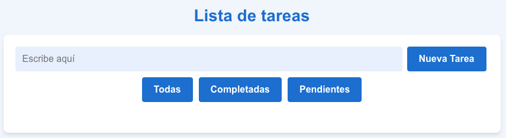
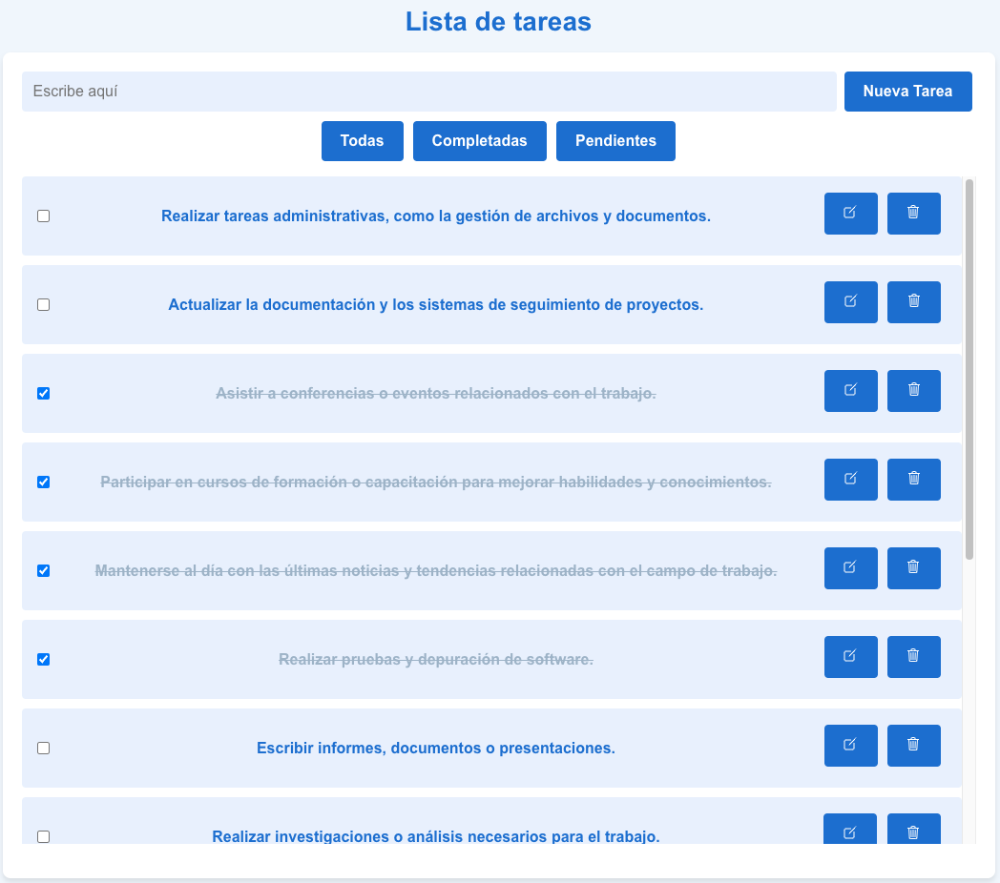

# Lista de Tareas en React

Este proyecto es una aplicación simple de Lista de Tareas desarrollada en React. Permite a los usuarios crear, editar y eliminar tareas, así como marcarlas como completadas. Es una implementación básica de una lista de tareas para ayudar a los usuarios a gestionar y realizar un seguimiento de sus actividades diarias.

## Características principales

- Crear nuevas tareas: Los usuarios pueden agregar nuevas tareas ingresando el   texto correspondiente en el campo de entrada provisto y haciendo clic en el botón "Nueva Tarea". Las tareas se agregarán a la lista de tareas pendientes.

- Editar tareas: Los usuarios pueden editar el texto de una tarea existente haciendo clic en el botón de edición (ícono de lápiz) junto a la tarea. Esto activará el modo de edición y permitirá al usuario modificar el texto de la tarea. Al hacer clic en el botón "Guardar" (ícono de marca de verificación), los cambios se guardarán y la tarea se actualizará con el nuevo texto.

- Marcar tareas como completadas: Los usuarios pueden marcar una tarea como completada haciendo clic en el checkbox junto a la tarea. Esto actualizará el estado de la tarea y aplicará un estilo visual para indicar que la tarea ha sido completada. Los usuarios también pueden desmarcar una tarea completada para marcarla como pendiente nuevamente.

- Eliminar tareas: Los usuarios pueden eliminar una tarea haciendo clic en el botón de eliminación (ícono de papelera) junto a la tarea. Esto eliminará permanentemente la tarea de la lista de tareas.

- Filtrar tareas: Los usuarios pueden filtrar las tareas por estado (todas, completadas o pendientes) utilizando los botones de filtro proporcionados. Al hacer clic en un botón de filtro, se mostrarán solo las tareas que coincidan con el estado seleccionado.

## Tecnologías utilizadas

El proyecto se ha desarrollado utilizando las siguientes tecnologías:

- React: Una biblioteca de JavaScript para construir interfaces de usuario interactivas y reutilizables.

- HTML y CSS: Para la estructura y estilos de la aplicación.

- react-icons: Una biblioteca que proporciona una amplia colección de iconos para su uso en aplicaciones de React.

- prop-types: Una biblioteca utilizada para validar las propiedades (props) de los componentes React y garantizar su correcta utilización.

## Capturas de Pantalla

## Instalación y Uso

Asegúrate de tener Node.js y npm instalados en tu máquina antes de continuar.

1. Ve al directorio del proyecto: `cd task-list-component`
2. Instala las dependencias: `npm install`
3. Inicia la aplicación: `npm start`
4. Abre tu navegador web y visita `http://localhost:3000`

## Estructura del Proyecto

El proyecto sigue la siguiente estructura de directorios:

├── src
│ ├── components
│ │ ├── App.js
│ │ ├── Task.js
│ │ ├── TaskList.js
│ │ └── ...
│ ├── styles
│ │ ├── App.css
│ │ ├── Task.css
│ │ ├── TaskList.css 
│ │ └── ...
│ ├── index.js
│ └── ...
├── public
│ ├── index.html
│ └── ...
├── screenshhots
| ├── TODOlist.png
│ ├── TODOlist.png
│ └── ...
├── package.json
└── ...

- `src/components`: Contiene los componentes de React utilizados en la aplicación.
- `src/styles`: Contiene los archivos CSS para los estilos de la aplicación.
- `src/index.js`: Punto de entrada de la aplicación.
- `public`: Contiene archivos públicos, como el archivo HTML base.
- `package.json`: Archivo de configuración de npm con las dependencias y scripts del proyecto.

